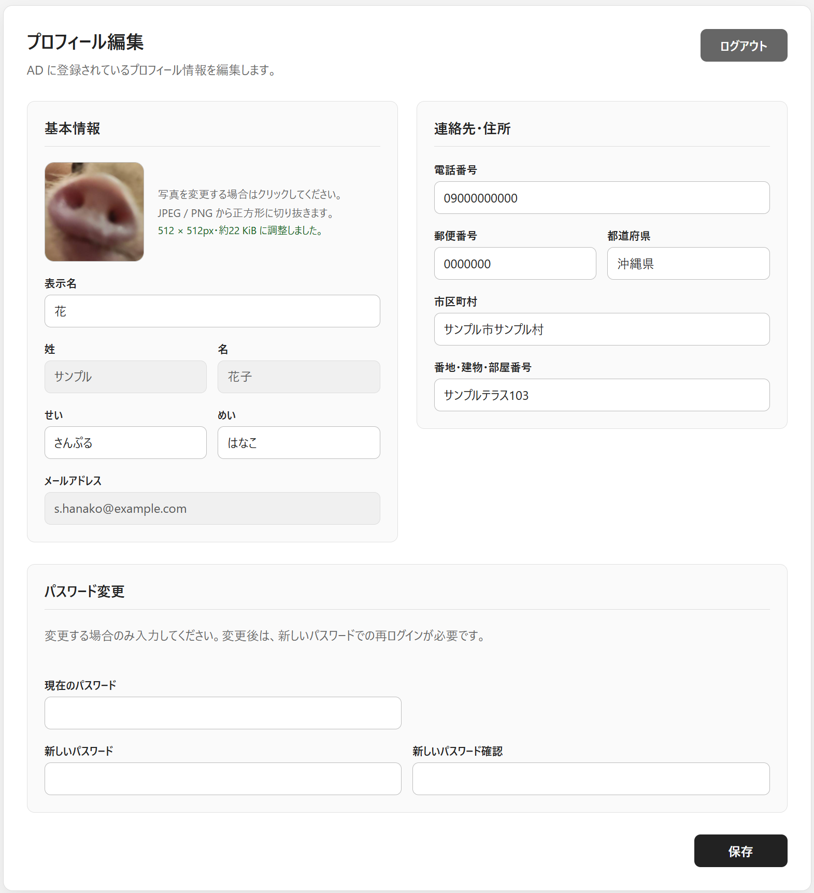
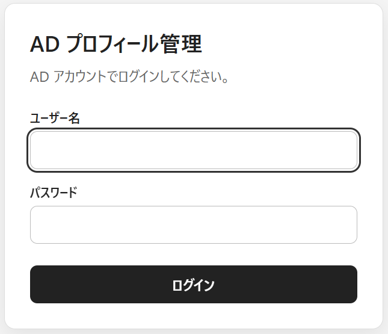
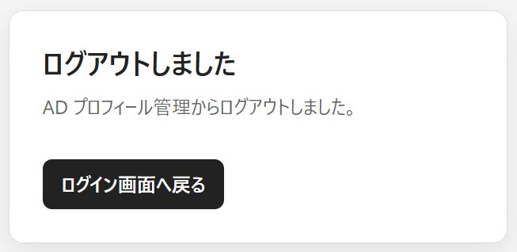

# adprofd

Active Directory（AD）の利用者が、自分のプロフィール情報を Web ブラウザから確認・更新するための Go アプリケーションです。AD アカウントで認証し、氏名のフリガナ、連絡先、住所などを LDAP 経由で編集できます。

## 画面

### プロフィール編集



<details>
<summary>ログイン・ログアウト画面</summary>

<p>
  
  
</p>

</details>

## 主な機能

- `sAMAccountName` または `userPrincipalName` を使った AD 認証
- リバースプロキシーから渡された共有トークンとユーザー名による認証
- ログイン中の利用者自身のプロフィール表示・更新
- 姓名、メールアドレスなどの読み取り専用表示
- 氏名のフリガナ、電話番号、郵便番号、住所などの編集
- プロフィール写真の正方形切り抜き、縮小、JPEG変換と更新
- 現在のパスワードによる本人確認を伴うADパスワード変更
- SQLite を利用したサーバーサイドセッション管理
- HTML テンプレートと静的ファイルの実行バイナリへの埋め込み

## AD 属性との対応

| 画面項目 | AD 属性 | 操作 |
| --- | --- | --- |
| 表示名 | `initials` | 参照・更新 |
| 姓 | `sn` | 参照のみ |
| 名 | `givenName` | 参照のみ |
| せい | `msDS-PhoneticLastName` | 参照・更新 |
| めい | `msDS-PhoneticFirstName` | 参照・更新 |
| メールアドレス | `mail` | 参照のみ |
| 電話番号 | `telephoneNumber` | 参照・更新 |
| 郵便番号 | `postalCode` | 参照・更新 |
| 都道府県 | `st` | 参照・更新 |
| 市区町村 | `l` | 参照・更新 |
| 番地・建物・部屋番号 | `streetAddress` | 参照・更新 |
| プロフィール写真 | `thumbnailPhoto` | 参照・更新 |
| パスワード | `unicodePwd` | 本人による変更 |

> [!NOTE]
> このアプリケーションの「表示名」は、AD の `displayName` ではなく `initials` 属性を参照・更新します。`initials` を本来のイニシャルや別の用途で使用している環境では、運用前に属性の割り当てを確認してください。

ユーザー検索は設定された Base DN 配下を対象とし、コンピューターアカウントを除外します。プロフィールの参照・更新にはサービスアカウントを使用し、ログイン認証時には検索で得たユーザー DN と入力されたパスワードで LDAP Bind を行います。パスワード変更時はサービスアカウントを使用せず、利用者本人の DN と現在のパスワードで Bind します。

## 動作要件

- Go 1.24 以降
- CGO が利用できるビルド環境（`go-sqlite3` のビルドに C コンパイラーが必要です）
- LDAPS で接続可能な Active Directory
- ドメインコントローラーの証明書を検証できる信頼済み CA 証明書
- 対象ユーザーを検索でき、対象属性を読み取り・更新できる AD サービスアカウント

## セットアップ

### 1. LDAP 接続情報を設定する

`.env.example` を `.env` にコピーし、接続先の AD 環境に合わせて値を変更してください。`.env` は Git の管理対象から除外されています。

```console
cp .env.example .env
```

設定が必要な値は次のとおりです。

| 環境変数 | 内容 |
| --- | --- |
| `ADPROFD_LISTEN_ADDR` | HTTP の待受アドレス（例: `127.0.0.1:8080`） |
| `ADPROFD_LDAP_URL` | ドメインコントローラーの LDAPS URL |
| `ADPROFD_LDAP_BASE_DN` | ユーザー検索を開始する Base DN |
| `ADPROFD_LDAP_BIND_DN` | 検索・プロフィール更新に使うサービスアカウントの DN |
| `ADPROFD_LDAP_BIND_PASSWORD` | サービスアカウントのパスワード |
| `ADPROFD_LDAP_TLS_SERVER_NAME` | ドメインコントローラー証明書のホスト名 |
| `ADPROFD_PROXYAUTH_TOKEN` | リバースプロキシーと共有するトークン（任意、空欄時は無効） |
| `ADPROFD_SESSION_DB_PATH` | セッションDBのパス（未設定時は `/var/lib/adprofd/session.sqlite3`） |
| `ADPROFD_SESSION_COOKIE_SECURE` | セッションCookieの `Secure` 属性（未設定時は `true`、平文HTTP運用時のみ `false`） |

サービスアカウントには、Base DN 配下のユーザー検索権限と、更新対象属性への必要最小限の書き込み権限を付与してください。

> [!CAUTION]
> 実際の認証情報を `.env.example` やソースコードへ記載しないでください。本番運用では systemd の `EnvironmentFile` などから同じ環境変数を設定してください。

### 2. 起動する

```console
go mod download
make run
```

`make run` は `.env` を読み込んで `go run .` を実行します。起動後、設定した待受アドレスをブラウザで開きます。

バイナリを作成する場合は次のコマンドを実行します。テンプレートと静的ファイルはバイナリに埋め込まれます。

```console
make build
./adprofd
```

生成したバイナリは `make clean` で削除できます。

### 3. systemdで起動する

付属の [`systemd/adprofd.service`](systemd/adprofd.service) は、`adprofd` ユーザーで `/usr/local/bin/adprofd` を起動し、`/etc/adprofd/adprofd.env` から環境変数を読み込みます。初回のみサービスアカウントを作成し、バイナリ、環境ファイル、ユニットを配置してください。

```console
sudo useradd --system --user-group --home-dir /var/lib/adprofd --shell /usr/sbin/nologin adprofd
sudo install -m 0755 adprofd /usr/local/bin/adprofd
sudo install -d -m 0750 /etc/adprofd
sudo install -m 0600 .env /etc/adprofd/adprofd.env
sudo install -m 0644 systemd/adprofd.service /etc/systemd/system/adprofd.service
```

配置する環境ファイルでは、セッションDBのパスを次のように設定します。

```dotenv
ADPROFD_SESSION_DB_PATH=/var/lib/adprofd/session.sqlite3
```

ユニットの `StateDirectory=adprofd` により、起動時に `/var/lib/adprofd` が作成され、`adprofd` ユーザーに必要な書き込み権限が設定されます。配置後にsystemdへ反映し、サービスを起動します。

```console
sudo systemctl daemon-reload
sudo systemctl enable --now adprofd
sudo systemctl status adprofd
```

## セッション

セッションは `ADPROFD_SESSION_DB_PATH` で指定した SQLite データベースに保存されます。未設定時のパスは `/var/lib/adprofd/session.sqlite3` です。親ディレクトリは事前に作成し、アプリケーションの実行ユーザーに書き込み権限を付与してください。`.env.example` ではローカル開発用に `./tmp/session.sqlite3` を指定しており、`make run` が `tmp/` ディレクトリを作成します。`tmp/` 以下の実行時データは Git の管理対象に含まれません。

セッションの有効期間は 8 時間、アイドルタイムアウトは 30 分です。

Cookie 名は `ADPROFDSESSION` です。`Secure` 属性は既定で有効です。一般的なブラウザでは `http://localhost` も開発用の信頼できる接続として扱われるため、通常のローカル開発では有効なまま使用できます。例外的に平文 HTTP で運用する場合のみ、`ADPROFD_SESSION_COOKIE_SECURE=false` を明示してください。

## パスワード変更

パスワード変更は、利用者本人の DN と現在のパスワードで LDAPS Bind した接続上で行います。`unicodePwd` に対する現在値の削除と新しい値の追加を、同一の LDAP Modify リクエストとして送信します。パスワードは引用符で囲んだ UTF-16LE としてエンコードし、ログやセッションには保存しません。変更成功後は現在のセッションを破棄します。通常認証では新しいパスワードでの再ログインを求め、リバースプロキシー認証ではプロキシーから渡された認証情報で新しいセッションを確立します。

Microsoft の仕様では、本人による変更には現在のパスワードが必要で、`unicodePwd` の更新には暗号化された接続が必要です。詳細は [Change a Windows Active Directory and LDS user password through LDAP](https://learn.microsoft.com/en-us/troubleshoot/windows-server/active-directory/change-windows-active-directory-user-password)、[Password Modify Operations](https://learn.microsoft.com/en-us/openspecs/windows_protocols/ms-adts/3983110d-4d24-4a59-baeb-db5b863a92c6) および [Description of password-change protocols in Windows](https://learn.microsoft.com/en-us/troubleshoot/windows-server/active-directory/password-change-mechanisms) を参照してください。

サービスアカウントはパスワード変更に使用しないため、対象ユーザーに対する「パスワードのリセット」権限は不要です。

このアプリケーションは内部利用者向けの自己管理ツールであるため、現在のパスワード違いと、長さ・複雑性・履歴・最小変更間隔などの AD パスワードポリシー違反は、利用者が入力を修正するか時間をおいて再試行できる入力エラーとして `400 Bad Request` を返します。最小変更間隔については LDAP の診断文から明確に判別できた場合に専用の案内を表示します。さらに、`pwdLastSet` と、`msDS-ResultantPSO` またはドメイン既定の `minPwdAge` を読み取れた場合は、次に変更できる日時も表示します。日時を算出できなくても、パスワード変更のエラー自体は入力エラーとして扱います。LDAP 接続失敗、権限不足、その他の予期しない LDAP エラーはサーバー側の障害として `500 Internal Server Error` を返します。

## リバースプロキシー認証

`ADPROFD_PROXYAUTH_TOKEN` を設定すると、次のリクエストヘッダーによる認証が有効になります。

| ヘッダー | 内容 |
| --- | --- |
| `X-PROXYAUTH-USER` | 認証済みユーザー名 |
| `X-PROXYAUTH-TOKEN` | `ADPROFD_PROXYAUTH_TOKEN` と同じ共有トークン |

両方のヘッダーがないリクエストは、従来どおりログインフォームとセッションで認証します。どちらか一方だけがある場合や共有トークンが一致しない場合は、既存セッションへフォールバックせず `401 Unauthorized` を返します。

初回アクセス時はユーザー名から AD の DN を検索し、ユーザー名と DN をセッションへ保存します。以後、プロキシーから渡されたユーザー名がセッションと同じ間は保存済みの DN を使用します。ユーザー名が変わった場合はセッションを初期化し、新しいユーザーとして DN を検索し直します。プロキシー認証中はログアウトボタンを表示しません。

保存済みの DN が AD 上に存在しなくなった場合は、他のセッション情報を引き継がないようセッション全体を破棄します。プロキシー認証中は次の `/profile` アクセスで新しい DN を検索し直し、通常認証中はログイン画面へ戻します。LDAP接続の一時的な失敗ではセッションを破棄しません。

共有トークンとユーザー名のヘッダーは、クライアントから受け取った値をリバースプロキシー側で必ず上書きしてください。共有トークンをログや公開設定へ記載しないでください。

## ルーティング

| メソッド | パス | 内容 |
| --- | --- | --- |
| `GET` | `/` | 未ログイン時はログイン画面、ログイン中はプロフィールへリダイレクト |
| `GET`, `POST` | `/login` | ログイン画面の表示、AD 認証。プロキシー認証済みの場合はプロフィールへリダイレクト |
| `GET`, `POST` | `/profile` | プロフィールの表示、更新（ログイン必須） |
| `POST` | `/logout` | セッションの破棄とログアウト |
| `GET` | `/static/` | CSS、JavaScript の配信 |

## ディレクトリ構成

```text
.
├── main.go                 # アプリケーションの初期化とルーティング
├── config.go               # 環境変数からの設定読み込み
├── ldap.go                 # LDAP データアクセス
├── session.go              # SQLite セッション管理
├── auth_session.go         # 認証セッションの取得・作成・破棄
├── proxy_auth.go             # リバースプロキシー認証
├── web_login.go            # ログイン・ログアウト画面
├── web_middleware.go       # HTTP ミドルウェア
├── web_profile.go          # プロフィール画面と更新処理
├── web_templates.go        # テンプレート・静的ファイルの埋め込みと描画
├── templates/              # HTML テンプレート
│   ├── login.html
│   ├── logout.html
│   └── profile.html
├── static/                 # CSS、JavaScript
│   ├── profile.js
│   └── style.css
├── systemd/
│   └── adprofd.service     # systemdユニット
├── tmp/                    # SQLite セッション DB（Git 管理外）
├── .env.example            # 開発用環境変数のサンプル
├── Makefile                # run、build、clean
├── go.mod
└── go.sum
```

## 既知の制約

- 必須環境変数が未設定の場合の起動時検証はまだ実装されていません。
- 入力値の形式・文字数に対する検証は限定的です。AD 側の制約に反する値は属性単位で更新に失敗します。
- HTTPS 終端、更新リクエストの `Origin` 検証、レート制限、クライアント IP の扱いは、リバースプロキシー側で設定する必要があります。
- LDAP との結合動作は自動テストの対象外です。

## 開発時の確認

```console
go test ./...
go vet ./...
```

共有トークン認証は、リバースプロキシーと同じヘッダーを付けた HTTP リクエストでテストします。AD との結合動作は、検証用ディレクトリと権限を制限したサービスアカウントを使って確認してください。パスワード変更の結合確認には、本番利用者とは別のテストアカウントを使用してください。
